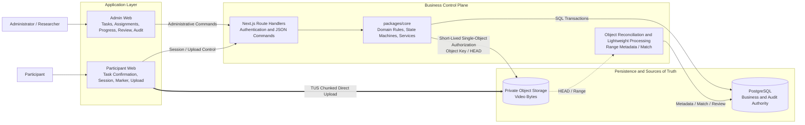
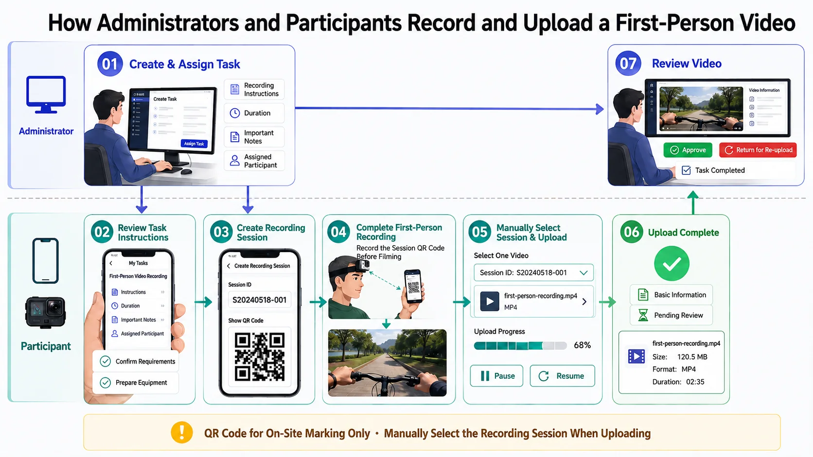
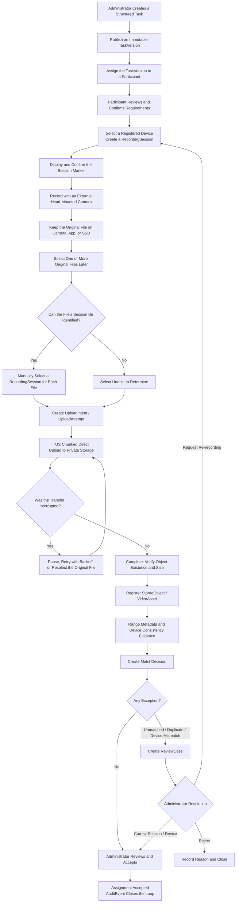
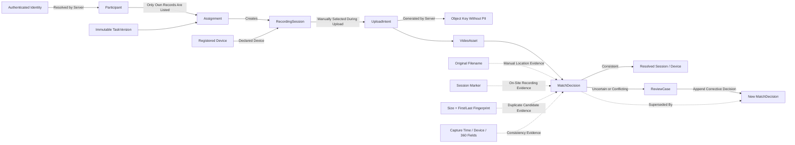
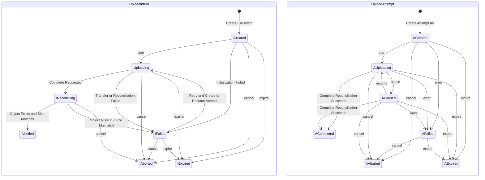

# EgoCapture MVP

[中文](README.md) | **English**

EgoCapture is a task management, file upload, and manual review system for first-person video data collection. It addresses more than the act of sending a video to a server. Recordings are captured on external cameras, files may first be copied to an SSD, and participants may upload them in batches hours later. The system must still answer these questions reliably:

- Who recorded this video?
- Which task version, device, and recording session does it belong to?
- How can a large upload resume after a network failure, pause, or page refresh without restarting from zero?
- After transfer, how does the system verify object integrity and ownership, then handle duplicates, missing files, and unmatched footage?
- How can an administrator correct mistakes without overwriting history, while a project lead sees accurate progress and exceptions?

The system is designed around an auditable evidence chain:

`Participant → Assignment → TaskVersion → Device → RecordingSession → UploadIntent / UploadAttempt → StoredObject → VideoAsset → MatchDecision → ReviewCase / AuditEvent`

## Table of Contents

- [System Architecture](#system-architecture)
- [Core Domain Model and Sources of Truth](#core-domain-model-and-sources-of-truth)
- [Video Collection Workflow](#video-collection-workflow)
- [How Videos Are Matched to Participants, Tasks, and Devices](#how-videos-are-matched-to-participants-tasks-and-devices)
- [Large-File Uploads and Resumable Transfer](#large-file-uploads-and-resumable-transfer)
- [Metadata, Manual Review, and Audit](#metadata-manual-review-and-audit)
- [Privacy and Security Boundaries](#privacy-and-security-boundaries)
- [Local Development and Validation](#local-development-and-validation)
- [Current Capability Boundaries and Engineering Trade-offs](#current-capability-boundaries-and-engineering-trade-offs)

## System Architecture

The system separates the low-bandwidth business control plane from the high-bandwidth video data plane. Tasks, identity, sessions, authorization, status, and review are handled by the control plane. Video bytes are uploaded directly from the browser to private object storage and never pass through a Next.js Route Handler.



This diagram defines the current responsibility boundaries: PostgreSQL stores business facts, Storage holds private object bytes, and the browser transfers the video. It does not imply that the system already supports multi-region disaster recovery, multi-day uploads of several gigabytes, or automated video-content decisions.

### Module Responsibilities

| Module | Primary Responsibilities | Explicitly Out of Scope |
|---|---|---|
| `apps/admin-web` | Participants, task versions, assignments, sessions, upload records, review cases, and audit events | Does not receive video request bodies or overwrite historical MatchDecisions |
| `apps/participant-web` | View tasks, confirm requirements, create sessions, display markers, select files, and pause or resume uploads | Cannot freely specify a Participant, TaskVersion, or object key |
| `packages/core` | Schema, domain rules, state machines, authentication, database access, storage, metadata, review, and audit | Does not treat UI state as database authority |
| `packages/ui` | Shared visual foundations for both applications | Does not contain page navigation or business decisions |
| `database/migrations` | Tables, constraints, RLS, views, triggers, and state-machine guards | Does not repair history by changing an applied migration |
| `infra/nas` | Self-hosted Supabase infrastructure dedicated to this project | Does not run the Next.js applications or manage containers owned by other projects |
| `scripts` / `tests` | Migrations, seed data, integration checks, Vitest, and Playwright | Seed data is not evidence of a real upload |

### Repository Layout

```text
apps/
├── admin-web/          Next.js application for administrators
└── participant-web/    Next.js application for participants
packages/
├── core/               Domain model, services, uploads, metadata, and security rules
└── ui/                 Shared UI foundations for both applications
database/migrations/    PostgreSQL schema, RLS, views, and constraints
infra/nas/              Five-service self-hosted Supabase Compose stack
scripts/                Database, seed, upload, and review integration checks
tests/                  Vitest unit tests and Playwright browser tests
docs/                   System guides, deployment guides, and standalone acceptance records
```

## Core Domain Model and Sources of Truth

The platform does not use the camera filename as a primary key, nor does it let the client submit an unrelated collection of `participantId`, `taskId`, and `deviceId` values. Every relationship is derived under server control from the preceding layer, producing a traceable business chain.

```mermaid
flowchart LR
    Participant[Participant]
    Task[Task<br/>Editable Draft]
    Version[TaskVersion<br/>Immutable After Publication]
    Assignment[Assignment<br/>Who Executes Which Version]
    Device[Device<br/>Registered Device]
    Session[RecordingSession<br/>One Physical Recording Event]
    Marker[SessionMarker<br/>Signed On-Site Marker]
    Batch[UploadBatch<br/>One Batch Selection]
    Intent[UploadIntent<br/>Business Intent for One File]
    Attempt[UploadAttempt<br/>One Transfer Attempt]
    Object[StoredObject<br/>Reconciled Storage Object]
    Asset[VideoAsset<br/>Business Video Asset]
    Match[MatchDecision<br/>Current Ownership and Correction Chain]
    Review[ReviewCase<br/>Exception Resolution]
    Audit[AuditEvent<br/>Append-Only Audit]

    Task -->|Publish| Version
    Participant --> Assignment
    Version --> Assignment
    Assignment --> Session
    Device --> Session
    Session --> Marker
    Participant --> Batch
    Batch --> Intent
    Session -->|Participant Claim| Intent
    Intent --> Attempt
    Intent --> Object
    Object --> Asset
    Asset --> Match
    Match --> Review
    Assignment -.Status Changes.-> Audit
    Session -.Creation and Confirmation.-> Audit
    Intent -.Upload and Reconciliation.-> Audit
    Review -.Manual Decisions.-> Audit
```



This diagram describes authority and entity lifecycles, not merely database foreign keys. `TaskVersion`, `MatchDecision`, and `AuditEvent` preserve history. When an administrator corrects ownership, the system appends a new decision linked to the superseded decision instead of overwriting the old value.

### Key Entities

| Entity | Problem It Solves | Key Constraint |
|---|---|---|
| `Task` / `TaskVersion` | Allows task instructions to evolve while preserving what the participant actually saw | A draft is editable; a published version and its `content_hash` are immutable |
| `Assignment` | Defines who must execute which task version and by when | The administrator assigns the Participant and TaskVersion |
| `Device` | Declares which device is used for a collection event | The device is fixed when the Session is created; metadata supplies consistency evidence only |
| `RecordingSession` | Turns a physical recording event into a referencable business object | Binds an Assignment, Device, time window, and Marker |
| `SessionMarker` | Leaves a visible, verifiable on-site marker at recording time | Generates and displays an Ed25519-signed payload; the MVP does not recognize it automatically in video |
| `UploadIntent` | Describes where one local file should be uploaded and which Session it is claimed to belong to | One Intent per file; the server generates the object key |
| `UploadAttempt` | Distinguishes multiple transfer attempts for the same file | Stores the attempt number, status, acknowledged bytes, and expiry |
| `StoredObject` / `VideoAsset` | Promotes a storage object into a manageable business asset | Created only after the object exists and its size matches |
| `MatchDecision` | Represents current ownership, an unmatched result, or a manual correction | Append-only; a view projects the current value without erasing history |
| `ReviewCase` / `AuditEvent` | Gives every exception an owner, reason, and resolution record | Critical administrative actions require a reason and an audit entry |

## Video Collection Workflow

The following diagram summarizes the complete first-person video collection loop from the perspectives of administrators and participants: task creation, on-site recording, resumable upload, and review.



> The QR code is currently used only as an on-site recording marker. During upload, the participant still selects the Recording Session for each file manually.

### End-to-End Flow

A collection is not complete merely because an upload progress bar reaches 100%. It starts with task definition, continues through physical recording, file transfer, technical reconciliation, and business review, and ends only when the footage is accepted or a re-recording is requested.



The primary path and exception branches use the same business entities. The system never deletes a video automatically because its filename looks similar, metadata is absent, or it appears to be a duplicate. The exception enters a ReviewCase, where an administrator uses the available evidence to correct, reject, or request a re-recording.

### Cross-Role Sequence

Recording occurs outside the platform, which is a fundamental business constraint. The platform establishes the Session before recording and reconnects the original file with its business context afterward.

```mermaid
sequenceDiagram
    actor Admin as Administrator
    participant Platform as EgoCapture Control Plane
    actor User as Participant
    participant Camera as External Camera / App
    participant Disk as Camera Storage / SSD
    participant Storage as Private Object Storage

    Admin->>Platform: Create a task and publish a TaskVersion
    Admin->>Platform: Create an Assignment with participant, version, and deadline
    Platform-->>User: Display fixed instructions and recording requirements
    User->>Platform: Confirm task, select Device, create RecordingSession
    Platform-->>User: Return Session ID and signed Marker
    User->>Camera: Show Marker to the camera and begin first-person recording
    Camera->>Disk: Save the unmodified original video
    Note over User,Disk: Files may be uploaded in a batch hours later; camera filenames are not reliable identifiers
    User->>Platform: Select original files and choose a Session for each file
    Platform-->>User: Return UploadIntent, Attempt, and short-lived single-object authorization
    User->>Storage: Upload directly in TUS chunks
    Storage-->>User: Return the acknowledged remote offset
    User->>Platform: Request Complete
    Platform->>Storage: Check object existence and actual size
    Storage-->>Platform: Return object information
    Platform->>Platform: Register VideoAsset, Metadata, Match / Review
    Platform-->>Admin: Display accepted footage or exception evidence
    Admin->>Platform: Accept, correct, reject, or request re-recording with a Reason
```

The Marker is on-site evidence captured during recording; manually selecting the Session is the participant's explicit claim at upload time. The MVP does not recognize the QR code from video frames automatically, and the presence of a Marker does not prove that the task content is valid.

### How Task Instructions Are Represented

Administrators maintain tasks through a structured form instead of asking participants to read unconstrained JSON. A published `TaskVersion` includes:

- Task title, objective, and instructions;
- Environment preparation and activity boundaries;
- Ordered execution steps and the visual evidence expected in each step;
- Required items, content that must be shown, and content that must be avoided;
- First-person perspective, hand-visibility, privacy, and location constraints;
- Completion criteria and how each criterion is verified;
- Allowed file sources, upload operations, and interruption-recovery guidance;
- Recording specifications such as duration, resolution, and frame rate.

Publication creates an immutable version and content hash, so every Assignment continues to reference the exact instructions shown to the participant at execution time. Later edits produce a new version and never retroactively change an existing collection.

## How Videos Are Matched to Participants, Tasks, and Devices

The matching problem exists because an external camera file such as `VID_001.mp4` contains no trustworthy business identity, and a single SSD may contain footage from multiple participants, tasks, and sessions. EgoCapture establishes authority through server-controlled relationships, then supplements those relationships with file and media evidence.



Solid lines represent business authority; dotted lines represent supporting evidence. A filename, Marker, fingerprint, or metadata record cannot independently override the Participant, Assignment, or RecordingSession.

### Matching Steps

1. **Authenticated identity resolves the Participant**: the server looks up the Participant associated with the current authenticated user; the client cannot upload another participant's ID.
2. **Assignment fixes the TaskVersion**: the upload page lists only tasks and Sessions accessible to the current participant.
3. **Session fixes the task and device context**: the participant creates a Session before recording and declares the Device used for this event.
4. **Each file receives its own Session selection**: even when five files are selected from an SSD at once, each file must be bound to a Session; when the participant genuinely cannot tell, they choose `Unable to Determine`.
5. **The server generates the object key**: the path uses only internal participant/upload IDs and a random filename; it excludes names, task titles, original filenames, and device serial numbers.
6. **Complete creates the MatchDecision**: a selected Session produces a `participant_claim`; an unidentified file produces `unmatched` and enters manual review.
7. **Metadata supplies consistency checks only**: capture time, device fields, and 360 projection can support or challenge the claim, but missing metadata is not inferred to be a mismatch.
8. **Administrative corrections append history**: a new decision points to the old decision through a supersession relationship, preserving who changed the ownership, when, and why.

## Large-File Uploads and Resumable Transfer

### Why Videos Upload Directly to Object Storage

If the browser first sends a multi-gigabyte video to the application server and the server then copies it to object storage, the system pays for double bandwidth, long-running connections, application-memory pressure, and additional instance scaling. EgoCapture therefore uses a two-stage design:

1. The control plane validates the participant, Session, file declaration, and quota; creates an `UploadIntent` / `UploadAttempt`; and returns short-lived credentials that can write only one object key.
2. The browser uses those credentials to send video bytes directly to private Storage. Next.js receives only progress, pause, completion, and exception commands.

### Current TUS Implementation

TUS is an HTTP-based resumable upload protocol. The current implementation treats a file as one continuous byte stream. Storage records how many consecutive bytes the TUS resource has received—the remote offset. To resume, the client locates the same resource, reads the acknowledged remote offset, and sends only the remaining bytes.

```mermaid
sequenceDiagram
    actor User as Participant
    participant Browser as Participant Web
    participant Worker as Hash Web Worker
    participant API as Next.js Control Plane
    participant DB as PostgreSQL
    participant Storage as Private Storage / TUS

    User->>Browser: Select original file and RecordingSession
    Browser->>Worker: Compute first/last fingerprint and full SHA-256
    Worker-->>Browser: Return fingerprint_v1 / source_sha256
    Browser->>API: Create UploadBatch and UploadIntent
    API->>DB: Validate identity, Session, quota; create Attempt #1
    API-->>Browser: Return object key, TUS endpoint, and short-lived authorization

    loop Each 6 MiB Chunk
        Browser->>Storage: PATCH chunk to the same TUS URL
        Storage-->>Browser: Return latest Upload-Offset
        Browser->>API: Report acknowledged bytes_uploaded
        API->>DB: Accept only monotonically increasing progress
    end

    alt User Pauses or Network Is Interrupted
        Browser->>Browser: Save v2 recovery manifest and TUS resource reference
        User->>Browser: Reselect original file after refresh
        Browser->>Worker: Recompute and validate full SHA-256, name, and size
        Browser->>Storage: Locate TUS URL and query remote offset
        Storage-->>Browser: Return acknowledged position
        Browser->>Storage: PATCH only missing bytes from the offset
    else TUS Resource Returns 404 / 410 or Attempt Expires
        Browser->>API: Explicitly request a new UploadAttempt
        API->>DB: Preserve old Attempt and create Attempt #N
        API-->>Browser: Return new authorization and recovery boundary
    end

    Browser->>API: Complete
    API->>Storage: Check object existence and actual size
    Storage-->>API: Return object info / size / ETag
    API->>DB: Idempotently register StoredObject, VideoAsset, MatchDecision
    API-->>Browser: transfer_status = verified
```

The browser cache helps recover which file was previously selected, which Session it was bound to, and which Attempt it used. The Storage remote offset remains the authority for how many bytes have actually arrived. A progress bar at 100% cannot replace Complete reconciliation, metadata processing, matching, or administrative acceptance.

### Mechanisms That Make Resumption Safe

| Mechanism | Current Implementation | Purpose |
|---|---|---|
| Chunking | Fixed 6 MiB chunks | Reduces the amount retransmitted after an individual failure |
| Automatic retry | `0 / 1 / 3 / 5 / 10 / 20` second backoff | Absorbs transient network failures and service instability |
| TUS resource lookup | `tus-js-client` stores the resource URL and retrieves it with `findPreviousUploads()` | Reconnects to the same remote upload |
| Browser recovery manifest | `localStorage` v2 indexed by the complete `source_sha256` | Restores the file, Session, Attempt, acknowledged bytes, and expiry state after refresh |
| Original-file validation | Filename, size, and full SHA-256 must all match | Prevents a different file from being appended to an existing resource after refresh |
| Progress authority | Storage offset plus monotonically increasing server-side `bytes_uploaded` | Prevents UI progress from moving backward or claiming completion |
| Pause | `abort(false)` stops current transmission while retaining the remote resource | Allows continuation from the same offset |
| Cancel | Terminates the UploadIntent and removes the local recovery record | Explicitly abandons the right to resume |
| Authorization renewal | Short-lived authorization lasts about two hours and can be reissued for a valid Attempt | Credential expiry does not require a new business object |
| Attempt lifetime | Approximately 24 hours | Prevents disconnected uploads from retaining resources indefinitely |
| Missing resource | A `404/410` marks the old resource as non-resumable | Prevents the client from silently starting at zero under the old Attempt |
| Completion reconciliation | The server checks that the object exists and its actual size equals the declared size | Does not trust the progress bar; the completion endpoint remains idempotent |

The full SHA-256 currently proves in the browser that a reselected file is the same original file. Server-side Complete currently verifies object existence and size, but does not compute a full server-side SHA-256. `fingerprint_v1 = SHA-256(file_size + first_1MiB + last_1MiB)` identifies a Duplicate Candidate only; it does not prove that two complete files are identical.

### Pause, Retry, New Attempt, and Cancel

- **Pause** stops new bytes from being sent while preserving the current TUS URL, Attempt, and remote offset, so the transfer can continue later.
- **Retry** handles network failures within the same Attempt using backoff, or reissues expired short-lived authorization.
- **New Attempt** preserves the old record and creates a new Attempt when the previous TUS resource is missing, returns `404/410`, has expired, or cannot be located locally. It must never pretend to resume the original resource.
- **Cancel** is an explicit participant action that moves the Intent/Attempt into a terminal state and clears the local recovery entry.

### Upload State Model

An `UploadIntent` represents the business upload target for one file. An `UploadAttempt` represents one concrete transfer attempt. One Intent may produce multiple Attempts after failure, so the attempt count is not the number of business files.



The upload service coordinates both state machines. Every transfer creates an independent Attempt. After an old Attempt fails or expires, a new Attempt starts from its own `created` state. Complete closes the current Attempt, registers the business objects, and moves the Intent to `verified` in one database transaction. `verified` means only that the Storage object has passed transfer reconciliation; it does not mean the task has been accepted by an administrator. The asset may still enter a ReviewCase because it is unmatched, a possible duplicate, inconsistent with the declared device, or invalid in content.

### Common Failures and Their Handling

| Scenario | System Behavior | Restart From Zero? |
|---|---|---|
| Brief disconnection or request timeout | Retry the current chunk using the backoff schedule | No |
| User pauses intentionally | Save local state and retain the remote resource | No |
| Page refresh or browser restart | Show the recovery manifest; require the original file to be reselected and validated | No, if the resource is still valid; resume from its offset |
| A different file is reselected | Reject resumption when full SHA-256, filename, or size differs | The different file cannot be written into the old resource |
| Short-lived upload authorization expires | Reissue single-object authorization within the valid Attempt | No |
| TUS URL returns `404/410` | Mark the resource as lost and explicitly create a new Attempt | Yes, the old remote bytes are unavailable |
| Attempt exceeds its lifetime | Expire the old Attempt and explicitly create a new Attempt and TUS resource | Yes, an expired resource is not reused |
| Object is missing at Complete | Fail the Intent and create an `upload_failed` ReviewCase | Storage must be inspected or the file retried |
| Object size differs at Complete | Refuse to register a VideoAsset and record `size_mismatch` | Re-upload or manual investigation is required |
| Size and first/last fingerprint suggest a duplicate | Create a Duplicate Candidate ReviewCase | Never delete or reject automatically |

### Production Design for Multi-Gigabyte and Multi-Day Uploads

The current MVP's 50 MB TUS path proves the control plane, chunking, pause/resume behavior, and completion reconciliation. Real 4K source footage should evolve to S3 Multipart Upload or a compatible object-storage implementation. The file is divided into independently numbered parts; each part can be uploaded, checksummed, and retried separately, while the server uses ListParts to retrieve the authoritative remote part inventory.

```mermaid
sequenceDiagram
    actor User as Participant
    participant Browser as Production Uploader
    participant IndexedDB as IndexedDB Recovery Manifest
    participant API as Upload Control API
    participant DB as PostgreSQL
    participant S3 as S3 / Compatible Object Storage

    Note over Browser,S3: Future production design; not delivered in the current MVP
    User->>Browser: Select multi-GB original file and bind RecordingSession
    Browser->>API: Create Multipart UploadIntent
    API->>DB: Store internal upload_id, file identity, and Session relationship
    API->>S3: CreateMultipartUpload
    S3-->>API: Return provider upload_id
    API-->>Browser: Return internal ID and short-lived part authorizations

    par Bounded Parallel Upload for Part 1
        Browser->>S3: PUT partNumber=1 + checksum
        S3-->>Browser: Return ETag / checksum
    and Bounded Parallel Upload for Parts 2..N
        Browser->>S3: PUT partNumber=N + checksum
        S3-->>Browser: Return ETag / checksum
    end
    Browser->>API: Report acknowledged part receipts
    API->>DB: Idempotently store partNumber / ETag / checksum
    Browser->>IndexedDB: Save file handle, part inventory, and Session

    alt Resume After Refresh, Network Change, or Another Day
        User->>Browser: Reauthorize access to the original file
        Browser->>API: Resume the same internal UploadIntent
        API->>S3: ListParts(provider upload_id)
        S3-->>API: Return authoritative remote part inventory
        API-->>Browser: Return missing parts and renewed short-lived authorization
        Browser->>S3: Upload only missing parts
    else User Cancels or Upload Is Abandoned
        API->>S3: AbortMultipartUpload
        API->>DB: Record aborted / expired status and cleanup result
    end

    Browser->>API: Request CompleteMultipartUpload
    API->>S3: Merge by partNumber + ETag
    S3-->>API: Return final object information
    API->>S3: Validate with HEAD / checksum
    API->>DB: Idempotently register StoredObject / VideoAsset
    API-->>Browser: Transfer complete; continue to Metadata / Match / Review
```

A production implementation must satisfy these constraints:

- **Server authority**: the browser cache helps restore the UI, but remote `ListParts` results and server receipts determine which parts are complete.
- **Upload only missing parts**: each part retries independently; changing networks or resuming days later must not retransmit confirmed parts.
- **Bounded concurrency**: dynamically limit concurrency according to network quality, device memory, and provider limits; never load all parts into memory at once.
- **Streaming file identity**: the current Worker reads the complete file to calculate SHA-256. Before supporting tens of gigabytes, hashing must become streaming or incremental to avoid a large memory spike.
- **Short-lived authorization**: the client receives temporary URLs only for a specific object key and part; long-lived cloud credentials never enter the browser.
- **Idempotent completion**: Complete must be safely retryable. The server verifies the part inventory, size, and checksum before creating the VideoAsset.
- **Reclaimable resources**: cancellation, expiry, and prolonged abandonment must run Abort and scheduled cleanup for orphaned parts and expired database state.
- **Global uploads**: select entry points or acceleration according to participant region and record network, retry, and throughput metrics continuously. Data-residency and cross-border requirements take precedence over speed optimization.

| Dimension | Current MVP: TUS | Production Evolution: S3 Multipart |
|---|---|---|
| File size | Real path limited to 50,000,000 bytes | Multi-GB / 4K original files |
| Resume authority | Continuous offset of one TUS resource | Discrete part inventory returned by `ListParts` |
| Browser persistence | `localStorage` v2 manifest | IndexedDB plus recoverable file handles or reauthorization |
| File hashing | Worker reads the complete file once | Streaming or incremental hashing to avoid large memory peaks |
| Concurrency | One continuous upload stream | Bounded parallel parts |
| Lifetime | Attempt lasts approximately 24 hours | Persistent internal session with short-lived part authorization renewed as needed |
| Completion | Object existence and size reconciliation | Part inventory, ETag/checksum, and final object reconciliation |
| Current status | Implemented and used by the MVP | Data-model reservation and design only; not delivered |

## Metadata, Manual Review, and Audit

### Lightweight Metadata Processing

After successful object reconciliation, the server parses video-container information with bounded HTTP Range requests:

- Processing times out after 25 seconds;
- At most 24 Range requests may read a cumulative maximum of 16 MiB;
- `mediainfo.js` provides general container and track fields, while `mp4box` supplements progressive MP4/QuickTime parsing;
- The system stores allowlisted container, duration, codec, width, height, frame rate, capture-time source, device, and 360-projection fields;
- A raw serial number is immediately transformed with HMAC-SHA256 and never stored in plaintext; GPS stores presence only, never coordinates;
- The processor does not extract frames, decode the full video, make automated content-compliance decisions, or generate proxy video.

Capture-time precedence is: reliable timezone-aware QuickTime creation date → container creation time → track creation time → browser `lastModified` → unknown. Upload time must never be treated as capture time.

### Matching and Exceptions

- A selected Session creates an initial `participant_claim` MatchDecision.
- `Unable to Determine` creates an initial `unmatched` decision and a manual review case.
- A matching size and `fingerprint_v1` from an existing file creates a `duplicate_candidate`, but never deletes automatically.
- Device metadata that conflicts with the Session declaration supplies Device Mismatch evidence for an administrator to assess.
- Missing metadata or a parsing failure records `metadata_unavailable` / failed; it does not imply that the video is invalid.

### Manual Decisions and Audit

An administrator can accept footage, correct its Session or Device, reject it, or request a re-recording. Critical actions require a Reason between 10 and 500 characters. A correction appends a MatchDecision and retains the previous decision through `supersedes_decision_id` / `superseded_by`.

Historical entities such as `TaskVersion`, `MatchDecision`, and `AuditEvent` use an append-only model, and database triggers prevent arbitrary UPDATE or DELETE operations on critical history. Project progress can therefore distinguish no upload, failed transfer, verified object, review required, re-recording required, and accepted. It never compresses all of those states into one ambiguous completion percentage.

## Privacy and Security Boundaries

- The Storage bucket is always private; downloads use short-lived, single-object signed URLs.
- When a Participant creates a Session or Upload, the server revalidates identity, participant status, consent, and resource ownership.
- Upload credentials can write only one exact object key; the browser never receives the service role key.
- Ordinary authenticated users cannot perform arbitrary Storage INSERT or SELECT operations, and database RLS limits their data scope.
- The original filename is retained only for manual location. Paths and control characters are stripped, length is limited to 255 characters, and the name never enters the object key or audit diff.
- Markers, URLs, object keys, and logs exclude names, email addresses, task titles, and device serial numbers.
- HTTP-only cookies, Origin validation, CSP, and `frame-ancestors 'none'` reduce session and page attack surfaces.
- Demo and test environments use only synthetic identities and videos without PII.
- The current MVP does not include malicious-file scanning, automated privacy-content detection, complete deletion governance, or cross-region data-residency orchestration. A private bucket is not a substitute for these controls.

## Local Development and Validation

### Requirements

- Node.js 24+
- pnpm 10.33.2 through Corepack
- Docker / Docker Compose

### Local Docker Mode

Docker runs PostgreSQL, GoTrue, PostgREST, Storage API, and the API Gateway. Both Next.js applications and tests run on the host.

```bash
corepack enable
pnpm install --frozen-lockfile
pnpm dev:local:setup
pnpm dev:local
```

Default addresses:

- Participant Web: <http://localhost:3000>
- Admin Web: <http://localhost:3001>
- Supabase API / Storage: `127.0.0.1:54321`
- PostgreSQL: `127.0.0.1:54322`

`pnpm dev:local:setup` generates random local secrets, starts the infrastructure, applies migrations, restores the idempotent seed, and runs baseline checks. A regular `pnpm dev:local:down` preserves the dedicated volume. Destruction requires the explicit, protected `pnpm dev:local:destroy` command.

### NAS Infrastructure Mode

A memory-constrained development machine can run only the five infrastructure services on a NAS. The Mac connects to the database and Storage through supervised SSH tunnels, while Next.js continues to run locally on the Mac.

```bash
pnpm dev:nas:setup
pnpm dev:nas
pnpm dev:nas:check
pnpm dev:nas:down
```

NAS mode manages only this project's `db`, `auth`, `rest`, `storage`, and `api-gateway` services. It does not run application source code and must not operate containers owned by other projects.

### Database and Validation Commands

```bash
pnpm db:status          # Show migration status
pnpm db:migrate         # Apply unapplied migrations in order
pnpm db:verify          # Validate migration checksums and database constraints
pnpm db:seed            # Idempotently restore the demo baseline
pnpm db:test:rls        # Validate RLS and ownership isolation

pnpm check              # ESLint + TypeScript + Vitest + production build
pnpm repo:safety        # Check secrets, large files, and media fixtures
pnpm upload:test        # Real TUS chunks, pause/resume, Complete, and Metadata
pnpm review:test        # MatchDecision, Review, and Audit
pnpm test:e2e           # Participant / Admin browser journeys
```

Migrations use sequential numbering, transactions, and SHA-256 checksums. Applied migrations must never be modified; every schema change requires the next migration number.

## Current Capability Boundaries and Engineering Trade-offs

| Design Area | Current Choice | Rationale and Cost |
|---|---|---|
| Video ownership | Manually select the RecordingSession during upload | Simple, explainable, and reviewable; participants can make mistakes, so metadata evidence and manual correction remain necessary |
| Session Marker | Generate, display, and confirm a signed Marker | Leaves on-site evidence for external recording; the current MVP does not recognize it automatically in video |
| Video transfer | Browser uploads directly to private Storage through TUS | Avoids application-server proxying; resource lifetime limits multi-day recovery |
| MVP file limit | 50,000,000 bytes per file and at most five files per batch | Proves a real chunked-transfer loop but does not represent production capacity for multi-gigabyte files |
| File identity | Full SHA-256 validates browser recovery; first/last fingerprint flags duplicate candidates | Full SHA-256 currently reads the file in one operation and must become streaming before scale-up |
| Completion check | Storage object existence and size | Low-cost and idempotent; no full server-side checksum yet |
| Metadata | Bounded Range reads and an allowlist | Avoids downloading or decoding the complete video; cannot prove that the visual content is valid |
| Exception decisions | ReviewCase plus append-only MatchDecision | Preserves a complete correction history but requires manual operational effort |
| Production large files | Planned S3 Multipart + IndexedDB + ListParts | Supports parallel, multi-day, missing-part-only recovery; not implemented or capacity-tested yet |
| Automated content checks | Excluded from the MVP | Avoids treating unreliable inference as business authority; privacy, black-frame, and task-compliance checks remain future work |

The MVP is complete when a participant establishes a RecordingSession against a fixed task version, uploads the original file to private storage through a resumable transfer, the system reconciles the object and creates traceable ownership, exceptions receive manual resolution, and an administrator either accepts the footage or explicitly requests a re-recording. No single-layer success—including Marker generation, 100% upload progress, or metadata extraction—can independently close the video-collection loop.
