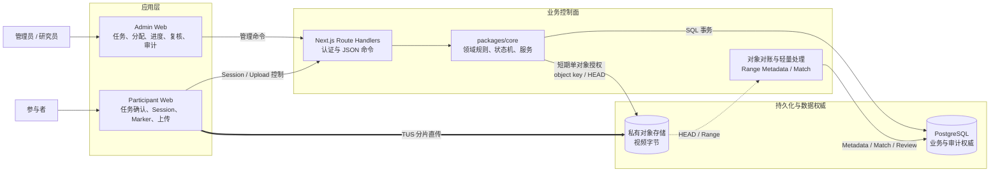
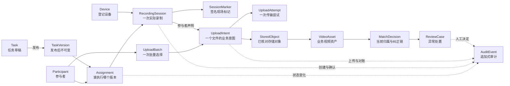
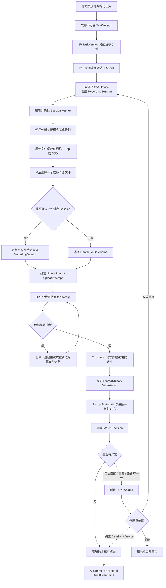
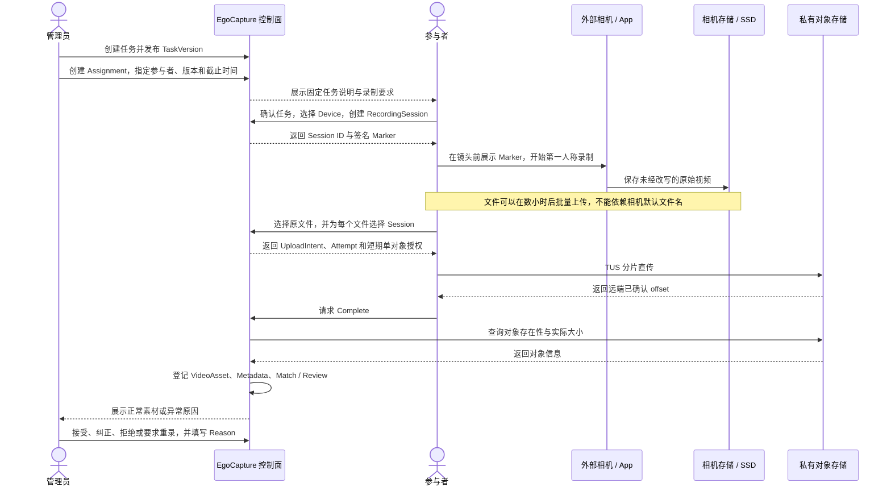
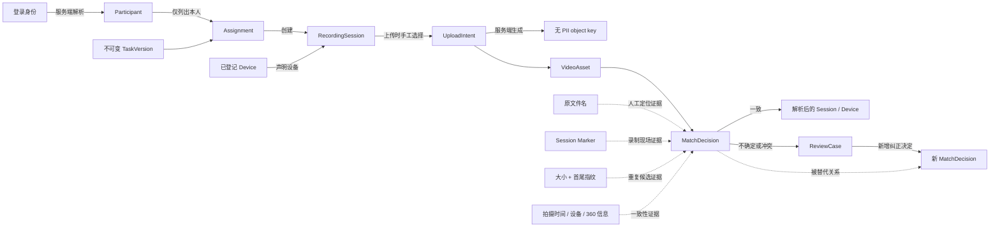
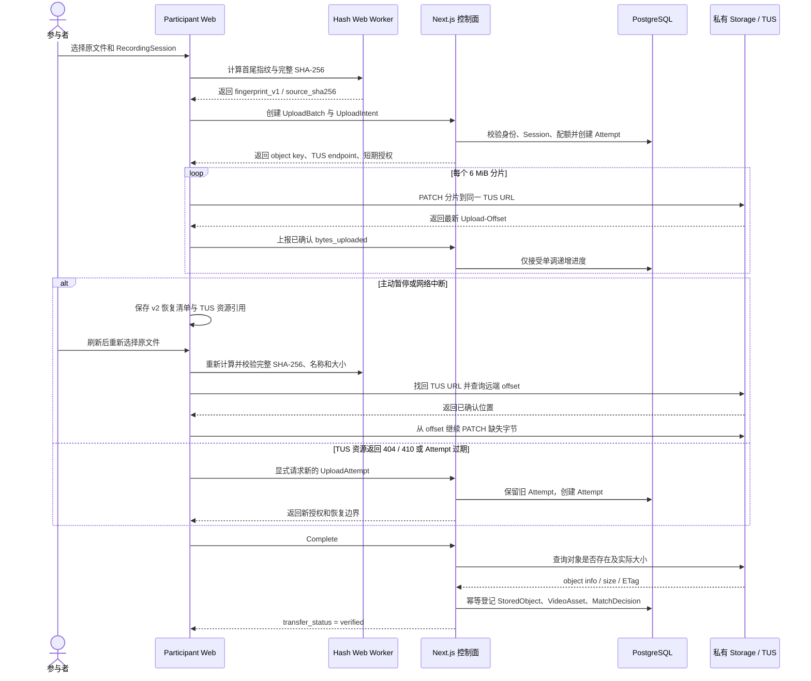
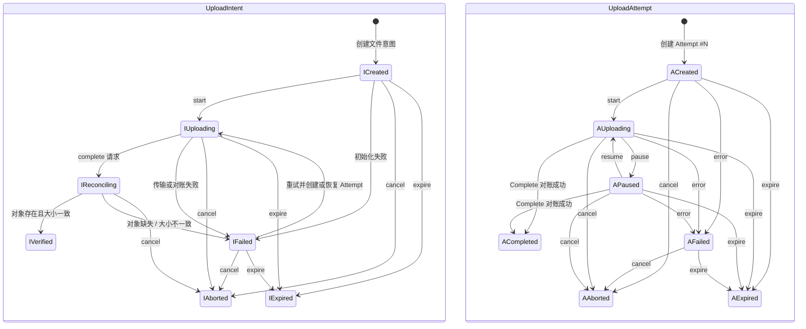
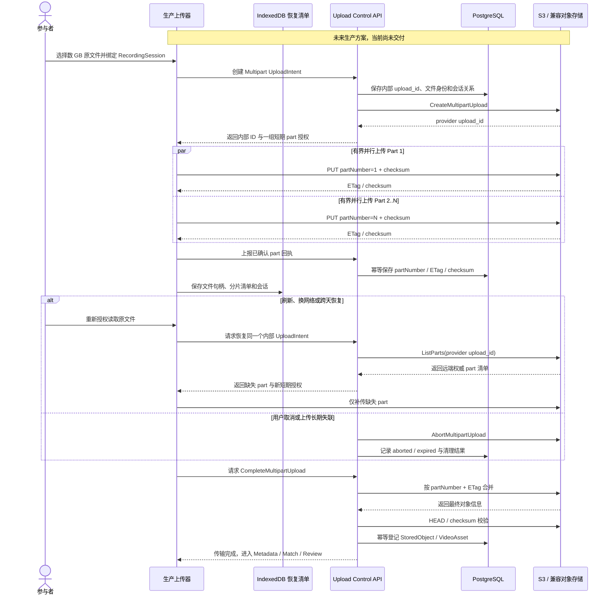

# EgoCapture MVP

EgoCapture 是一套面向第一人称视频数据采集的任务管理、文件上传与人工复核系统。它解决的不是“把视频传到服务器”这一个动作，而是如何在录制发生于外部相机、文件可能先进入 SSD、参与者稍后再批量上传的情况下，仍然可靠回答以下问题：

- 这段视频由谁录制？
- 它对应哪个任务版本、设备和录制会话？
- 大文件在断网、暂停或页面刷新后，如何避免从头重传？
- 文件传完后，如何确认对象完整、归属合理，并处理重复、缺失和无法匹配的素材？
- 管理员如何纠正错误而不覆盖历史，项目负责人如何看到真实进度和异常？

系统围绕一条可审计证据链设计：

`Participant → Assignment → TaskVersion → Device → RecordingSession → UploadIntent / UploadAttempt → StoredObject → VideoAsset → MatchDecision → ReviewCase / AuditEvent`

## 目录

- [系统总体架构](#系统总体架构)
- [核心领域模型与数据权威](#核心领域模型与数据权威)
- [视频采集业务流程](#视频采集业务流程)
- [视频如何匹配到参与者、任务和设备](#视频如何匹配到参与者任务和设备)
- [大文件上传与断点续传](#大文件上传与断点续传)
- [Metadata、人工复核与审计](#metadata人工复核与审计)
- [隐私与安全边界](#隐私与安全边界)
- [本地运行与验证](#本地运行与验证)
- [当前能力边界与工程权衡](#当前能力边界与工程权衡)

## 系统总体架构

系统将低带宽的业务控制面和高带宽的视频数据面分开。任务、身份、会话、授权、状态和审核通过控制面处理；视频字节由浏览器直接写入私有对象存储，不经过 Next.js Route Handler 中转。



这张图表达的是当前职责边界：PostgreSQL 保存业务事实，Storage 保存私有对象字节，浏览器承担视频传输。它不代表系统已经具备多区域容灾、数 GB 跨天上传或自动视频内容判断能力。

### 模块职责

| 模块 | 主要职责 | 明确不负责 |
|---|---|---|
| `apps/admin-web` | 参与者、任务版本、Assignment、Session、上传记录、ReviewCase、AuditEvent | 不接收视频请求体，不直接改写历史 MatchDecision |
| `apps/participant-web` | 查看任务、确认要求、创建 Session、展示 Marker、选择文件、暂停和恢复上传 | 不自由指定 Participant、TaskVersion 或 object key |
| `packages/core` | Schema、领域规则、状态机、Auth、DB、Storage、metadata、review、audit | 不把 UI 状态当成数据库权威 |
| `packages/ui` | 两端共享的视觉基础组件 | 不承载页面导航或业务判断 |
| `database/migrations` | 表、约束、RLS、View、Trigger 和状态机守卫 | 不通过修改已应用 Migration 修补历史 |
| `infra/nas` | 本项目自托管 Supabase 基础设施 | 不运行 Next.js 应用，不接管其他项目容器 |
| `scripts` / `tests` | Migration、Seed、集成检查、Vitest 与 Playwright | Seed 数据不充当真实上传证明 |

### 工程目录

```text
apps/
├── admin-web/          管理端 Next.js 应用
└── participant-web/    参与者端 Next.js 应用
packages/
├── core/               领域模型、服务、上传、Metadata 与安全规则
└── ui/                 双端共享 UI 基础
database/migrations/    PostgreSQL Schema、RLS、View 与约束
infra/nas/              自托管 Supabase 五服务 Compose
scripts/                数据库、Seed、上传与审核集成检查
tests/                  Vitest 单元测试与 Playwright 浏览器测试
docs/                   系统说明、部署说明与独立验收记录
```

## 核心领域模型与数据权威

平台不把摄像机文件名当主键，也不允许客户端提交一组彼此无关的 participantId、taskId 和 deviceId。每一层关系都从上一层受控推导，形成可追踪的业务链。



这张图表达的是数据权威和实体生命周期，不是简单的数据库外键截图。`TaskVersion`、`MatchDecision` 和 `AuditEvent` 保留历史；管理员纠正归属时新增决定并关联被替代决定，而不是覆盖旧值。

### 关键对象

| 对象 | 解决的问题 | 关键约束 |
|---|---|---|
| `Task` / `TaskVersion` | 任务说明如何演进，同时保留参与者当时看到的内容 | 草稿可编辑；发布版本及 `content_hash` 不可变 |
| `Assignment` | 谁在什么期限内执行哪个任务版本 | Participant 与 TaskVersion 由管理员分配 |
| `Device` | 本次采集声明使用哪台设备 | Session 创建时固定声明设备，metadata 只做一致性证据 |
| `RecordingSession` | 把一次现实世界录制变成可引用业务对象 | 绑定 Assignment、Device、时间与 Marker |
| `SessionMarker` | 在外部录制开始时留下可见且可验签的现场标记 | 当前生成和展示 Ed25519 签名载荷，不自动从视频识别 |
| `UploadIntent` | 描述“这个本地文件准备上传到哪里、声称属于哪个 Session” | 一个文件一个 Intent，object key 由服务端生成 |
| `UploadAttempt` | 区分同一文件的多次传输尝试 | 保存 Attempt 编号、状态、确认字节和有效期 |
| `StoredObject` / `VideoAsset` | 把存储对象提升为可管理业务资产 | 对象存在且大小一致后才创建 |
| `MatchDecision` | 表达当前归属、无法匹配或人工纠正 | 追加写；当前值由 View 投影，不覆盖历史 |
| `ReviewCase` / `AuditEvent` | 让异常有负责人、有原因、有处置记录 | 关键管理动作必须带 Reason 并写审计 |

## 视频采集业务流程

### 端到端主流程

一次采集并不是“上传进度达到 100%”就结束。它从任务定义开始，经过现实世界录制、文件传输、技术核验和业务复核，最终才进入接受或重录闭环。



主路径和异常支路共享同一套业务对象。系统不会因为 filename 相似、metadata 缺失或疑似重复就自动删除视频；异常进入 ReviewCase，由管理员基于证据纠正、拒绝或要求重录。

### 跨角色协作时序

录制发生在系统之外，这是业务设计的关键前提。平台负责在录制前建立 Session，在录制后重新接住原文件和业务上下文。



这里的 Marker 是录制时的现场证据，手工选择 Session 是当前上传时的明确声明。MVP 不从视频画面自动识别二维码，也不把 Marker 的存在等同于任务内容已经合格。

### 任务说明如何表示

Admin 通过结构化表单维护任务，而不是让参与者阅读一段无约束 JSON。发布后的 `TaskVersion` 包含：

- 任务标题、目标和说明；
- 环境准备与活动范围；
- 有序执行步骤及每步应出现的画面证据；
- 必需物品、必须展示和必须避开的内容；
- 第一人称视角、手部可见、隐私和空间限制；
- 完成标准及其验证方式；
- 允许的文件来源、上传操作和中断恢复说明；
- 录制规格，例如时长、分辨率与帧率。

发布后生成不可变版本和内容哈希，使 Assignment 始终指向参与者实际执行时看到的要求。后续修改任务只产生新版本，不追溯改变已有采集。

## 视频如何匹配到参与者、任务和设备

匹配问题的根源是：外部相机生成的 `VID_001.mp4` 不包含可信业务身份，同一块 SSD 上又可能混有多名参与者、多项任务和多个拍摄会话。EgoCapture 用服务端关系建立权威，再用文件和媒体信息补充证据。



实线表示业务权威，虚线表示辅助证据。文件名、Marker、指纹和 metadata 都不能单独覆盖 Participant、Assignment 或 RecordingSession。

### 匹配步骤

1. **登录身份确定 Participant**：服务端根据当前认证用户查找 Participant，客户端不能上传别人的 participantId。
2. **Assignment 固定 TaskVersion**：上传页面只展示当前参与者有权访问的任务和 Session。
3. **Session 固定任务与设备上下文**：参与者录制前创建 Session，并声明本次使用的 Device。
4. **每个文件单独选择 Session**：即使一次从 SSD 选择五个文件，也要逐文件绑定 Session；确实无法判断时选择 `Unable to Determine`。
5. **服务端生成 object key**：路径只使用内部 participant/upload ID 和随机文件名，不包含姓名、任务标题、原文件名或设备序列号。
6. **Complete 后创建 MatchDecision**：已选择 Session 的文件形成 `participant_claim`；无法确认的文件形成 `unmatched` 并进入人工复核。
7. **Metadata 只做一致性检查**：拍摄时间、设备字段和 360 投影可支持或质疑声明，但缺失 metadata 不会被推断成 mismatch。
8. **管理员纠正时追加历史**：新的决定通过 supersede 关系指向旧决定，保留谁在何时因何原因修正了归属。

## 大文件上传与断点续传

### 为什么视频必须直传对象存储

如果浏览器先把几 GB 视频传给应用服务器，再由应用服务器复制到对象存储，会产生双倍带宽、长连接超时、进程内存压力和应用实例扩容成本。EgoCapture 因此采用两段式设计：

1. 控制面验证参与者、Session、文件声明和配额，创建 `UploadIntent` / `UploadAttempt`，返回短期且只允许写入一个 object key 的凭据。
2. 浏览器使用该凭据把视频字节直接传到私有 Storage；Next.js 只接收进度、暂停、完成和异常命令。

### 当前 TUS 实现

TUS 是基于 HTTP 的可恢复上传协议。当前实现把文件看成一个连续字节流：Storage 为每个 TUS 资源保存“已经连续接收了多少字节”，即远端 offset。恢复上传时客户端先找回同一资源，再从远端确认的 offset 继续发送剩余字节。



浏览器缓存用于找回“我曾经传过哪个文件、绑定哪个 Session、对应哪个 Attempt”；Storage 的远端 offset 才是“已经收到多少字节”的传输权威。前端进度达到 100% 不能代替 Complete 对账，也不能代替后续 metadata、match 和人工接受。

### 断点续传的关键机制

| 机制 | 当前实现 | 目的 |
|---|---|---|
| 分片 | 固定 6 MiB | 降低单次失败重传成本 |
| 自动重试 | `0 / 1 / 3 / 5 / 10 / 20` 秒退避 | 吸收短暂断网和服务抖动 |
| TUS 资源定位 | `tus-js-client` 保存资源 URL，并通过 `findPreviousUploads()` 找回 | 重新连接同一个远端上传 |
| 浏览器恢复清单 | `localStorage` v2，以完整 `source_sha256` 索引 | 刷新后恢复文件、Session、Attempt、确认字节和到期状态 |
| 原文件校验 | 文件名、大小、完整 SHA-256 同时匹配 | 防止用户刷新后选错文件并接着写入旧资源 |
| 进度权威 | Storage offset + 服务端单调 `bytes_uploaded` | UI 百分比不能倒退或伪造完成 |
| Pause | `abort(false)` 停止当前发送，保留远端资源 | 稍后从相同 offset 继续 |
| Cancel | 终止 UploadIntent，并清除本地恢复记录 | 明确放弃继续资格 |
| 授权续期 | 短期授权约 2 小时；有效 Attempt 内可重新签发 | 凭据过期不必重建业务对象 |
| Attempt 有效期 | 约 24 小时 | 限制失联上传长期占用资源 |
| 资源丢失 | `404/410` 时标记旧资源不可恢复 | 防止客户端在旧 Attempt 下静默从 0 新建资源 |
| 完成对账 | 服务端检查对象存在且实际大小等于声明大小 | 不相信前端进度条；完成接口保持幂等 |

当前完整 SHA-256 用于浏览器侧“重新选择的是不是同一原文件”，服务端 Complete 目前只核对对象存在性和大小，并未做服务端全文件 SHA-256 校验。`fingerprint_v1 = SHA-256(file_size + first_1MiB + last_1MiB)` 仅用于提示 Duplicate Candidate，不用于宣布文件内容完全相同。

### Pause、Retry、New Attempt 和 Cancel 的区别

- **Pause**：停止发送新字节，保留当前 TUS URL、Attempt 和远端 offset，可以继续。
- **Retry**：同一个 Attempt 内对网络失败进行退避重试，或重新签发已经过期的短期授权。
- **New Attempt**：旧 TUS 资源不存在、返回 `404/410`、Attempt 已过期或本地找不到原资源引用时，保留旧记录并新建 Attempt；不得伪装成原资源续传。
- **Cancel**：参与者主动终止业务上传，服务端将 Intent/Attempt 置为终态并清理本地恢复入口。

### 上传状态模型

`UploadIntent` 表示一个文件的业务上传目标，`UploadAttempt` 表示一次具体传输尝试。同一个 Intent 可以在失败后产生新的 Attempt，因此“重试次数”和“业务文件数量”不是同一个概念。



两个状态机由上传服务协调：每次传输创建一条独立 Attempt；旧 Attempt 失败或过期后，新 Attempt 从自己的 `created` 状态开始。Complete 在同一数据库事务中关闭当前 Attempt、登记业务对象并把 Intent 推进到 `verified`。`verified` 只表示 Storage 对象已经完成传输对账，不表示任务已经被管理员接受。业务仍可能因为无法匹配、疑似重复、设备不一致或内容问题进入 ReviewCase。

### 常见失败与处理

| 场景 | 系统行为 | 是否从头重传 |
|---|---|---|
| 短时断网、请求超时 | 对当前分片按退避策略重试 | 否 |
| 用户主动暂停 | 保存本地状态，远端资源保留 | 否 |
| 页面刷新或浏览器重开 | 展示恢复清单，要求用户重新选择原文件并校验 | 否，资源仍有效时从 offset 继续 |
| 重新选择了不同文件 | 完整 SHA-256、名称或大小不一致，拒绝恢复 | 不允许写入旧资源 |
| 短期上传授权过期 | 在有效 Attempt 内重新签发单对象授权 | 否 |
| TUS URL 返回 `404/410` | 标记资源丢失，显式创建新 Attempt | 是，旧远端字节已不可用 |
| Attempt 超过有效期 | 旧 Attempt 进入过期状态，显式创建新 Attempt 和新 TUS 资源 | 是，当前不续用过期资源 |
| Complete 时对象不存在 | Intent 失败并创建 `upload_failed` ReviewCase | 需要检查 Storage 或重试 |
| Complete 时大小不一致 | 拒绝登记 VideoAsset，记录 `size_mismatch` | 需要重新上传或人工排查 |
| 大小和首尾指纹疑似重复 | 创建 Duplicate Candidate ReviewCase | 不自动删除，也不自动拒绝 |

### 生产级数 GB / 跨天上传方案

当前 MVP 的 50 MB TUS 路径用于证明控制面、分片、暂停恢复和完成对账。面向真实 4K 原始视频，应演进为 S3 Multipart 或兼容对象存储的 Multipart Upload：文件被拆成独立编号的 part，每个 part 单独上传、校验和重试，服务端通过 ListParts 获取远端已确认清单。



生产方案必须满足以下约束：

- **服务端权威**：浏览器缓存只帮助恢复界面，远端 `ListParts` 和服务端回执决定哪些 part 已完成。
- **只补缺片**：每个 part 独立重试，网络切换或跨天恢复不重传已经确认的部分。
- **有界并行**：根据网络质量、设备内存和供应商限制动态控制并发，不能一次把全部 part 放入内存。
- **流式文件身份**：当前 Worker 会读取完整文件计算 SHA-256；扩展到几十 GB 前必须改为流式/分块 hash，避免一次性 `arrayBuffer()` 占用巨大内存。
- **短期授权**：客户端只拿到指定 object key 和 part 的短期 URL，长期云凭据不进入浏览器。
- **幂等完成**：Complete 可安全重试；服务端必须确认 part 清单、大小和 checksum 后再创建 VideoAsset。
- **可回收**：取消、超期和长期失联必须执行 Abort，并用定时任务清理残片和过期数据库状态。
- **全球上传**：根据参与者区域选择接入点或加速能力，持续记录网络、重试和吞吐指标；数据驻留与跨境规则优先于速度优化。

| 维度 | 当前 MVP：TUS | 生产演进：S3 Multipart |
|---|---|---|
| 文件规模 | 真实路径限制为 50,000,000 bytes | 面向数 GB / 4K 原始文件 |
| 恢复权威 | 同一 TUS 资源的连续 offset | `ListParts` 返回的离散 part 清单 |
| 浏览器持久化 | `localStorage` v2 清单 | IndexedDB + 可恢复文件句柄/重新授权 |
| 文件哈希 | Worker 一次读取完整文件 | 流式或分块计算，避免大内存峰值 |
| 并发 | 单一连续上传流 | 多 part 有界并行 |
| 有效期 | Attempt 约 24 小时 | 持久内部会话，短期 part 授权按需续签 |
| 完成 | 对象存在与大小对账 | part 清单、ETag/checksum、最终对象对账 |
| 当前状态 | 已实现并用于 MVP | 仅有数据模型预留和设计，尚未交付 |

## Metadata、人工复核与审计

### 轻量 Metadata 处理

对象对账成功后，服务端通过有限的 HTTP Range 请求解析视频容器信息：

- 主动处理超时 25 秒；
- 最多 24 个 Range 请求，累计读取最多 16 MiB；
- `mediainfo.js` 提供通用容器/轨道字段，`mp4box` 补充 MP4/QuickTime 渐进解析；
- 保存 allowlist 中的容器、时长、编码、宽高、帧率、拍摄时间来源、设备和 360 投影字段；
- 原始 serial 立即做 HMAC-SHA256，不保存明文；GPS 只保存是否存在，不保存坐标；
- 不抽帧、不解码、不执行自动内容合规判断，也不生成代理视频。

拍摄时间优先级为：可靠时区的 QuickTime creation date → container create time → track create time → 浏览器 `lastModified` → unknown。上传时间不能当作拍摄时间。

### 匹配与异常

- 已选择 Session：初始 MatchDecision 为 `participant_claim`。
- 选择 Unable to Determine：初始决定为 `unmatched`，创建人工复核。
- 大小和 `fingerprint_v1` 与既有文件一致：创建 `duplicate_candidate`，但不自动删除。
- metadata 设备字段与 Session 声明不一致：提供 Device Mismatch 证据，由管理员判断。
- metadata 缺失或解析失败：记录 `metadata_unavailable` / failed，不反向推断视频一定无效。

### 人工决定与审计

管理员可以接受素材、纠正 Session/Device、拒绝或要求重录。关键动作要求填写 10～500 字符的 Reason。纠正操作新增 MatchDecision，并通过 `supersedes_decision_id` / `superseded_by` 保留旧决定。

`TaskVersion`、`MatchDecision`、`AuditEvent` 等历史对象采用追加写模型，数据库 Trigger 阻止关键历史被任意 UPDATE/DELETE。项目进度因此能够区分“没有上传”“传输失败”“对象已验证”“需要复核”“需要重录”和“已经接受”，而不是用一个模糊的完成百分比代表全部状态。

## 隐私与安全边界

- Storage bucket 固定为 private；下载通过单对象、短时 signed URL。
- Participant 创建 Session 或 Upload 时，服务端重新校验身份、参与者状态、Consent 和资源归属。
- 上传凭据只允许写入一个精确 object key；浏览器永远拿不到 service role key。
- 普通 authenticated 用户没有任意 Storage INSERT/SELECT 权限，数据库使用 RLS 限制数据范围。
- 原文件名仅用于人工定位：去掉路径和控制字符、最长 255 字符，不进入 object key 或 Audit diff。
- Marker、URL、object key 和日志不包含姓名、邮箱、任务标题或设备序列号。
- HTTP-only Cookie、Origin 检查、CSP 和 `frame-ancestors 'none'` 降低会话与页面攻击面。
- Demo/测试只能使用合成身份和无 PII 视频。
- 当前 MVP 没有恶意文件扫描、自动隐私内容检测、完整数据删除治理或跨区域数据驻留编排；这些不能由“私有 bucket”替代。

## 本地运行与验证

### 环境要求

- Node.js 24+
- pnpm 10.33.2（通过 Corepack）
- Docker / Docker Compose

### 本机 Docker 模式

Docker 运行 PostgreSQL、GoTrue、PostgREST、Storage API 和 API Gateway；两套 Next.js 应用及测试在宿主机运行。

```bash
corepack enable
pnpm install --frozen-lockfile
pnpm dev:local:setup
pnpm dev:local
```

默认地址：

- Participant Web：<http://localhost:3000>
- Admin Web：<http://localhost:3001>
- Supabase API / Storage：`127.0.0.1:54321`
- PostgreSQL：`127.0.0.1:54322`

`pnpm dev:local:setup` 会生成本地随机秘密、启动基础设施、执行 Migration、幂等 Seed 和基础校验。普通 `pnpm dev:local:down` 保留专属 volume；销毁数据必须显式使用受保护的 `pnpm dev:local:destroy`。

### NAS 基础设施模式

内存受限的开发机可以只在 NAS 运行五个基础服务，Mac 通过受监督 SSH Tunnel 连接数据库和 Storage，Next.js 仍在 Mac 本地运行。

```bash
pnpm dev:nas:setup
pnpm dev:nas
pnpm dev:nas:check
pnpm dev:nas:down
```

NAS 模式只管理本项目的 `db`、`auth`、`rest`、`storage`、`api-gateway`，不运行应用源码，也不应操作其他项目容器。

### 数据库与验证命令

```bash
pnpm db:status          # 查看 Migration 状态
pnpm db:migrate         # 顺序执行未应用 Migration
pnpm db:verify          # 校验 Migration checksum 与数据库约束
pnpm db:seed            # 幂等恢复 Demo 基线
pnpm db:test:rls        # 验证 RLS 与所有权隔离

pnpm check              # ESLint + TypeScript + Vitest + production build
pnpm repo:safety        # 检查秘密、大文件和媒体 Fixture
pnpm upload:test        # 真实 TUS 分片、暂停恢复、Complete 与 Metadata
pnpm review:test        # MatchDecision、Review 与 Audit
pnpm test:e2e           # Participant / Admin 浏览器主流程
```

Migration 使用顺序编号、事务和 SHA-256 checksum。已经应用的 Migration 不得修改；数据结构变化必须新增下一编号文件。

## 当前能力边界与工程权衡

| 设计点 | 当前选择 | 原因与代价 |
|---|---|---|
| 视频归属 | 上传时手动选择 RecordingSession | 简单、可解释、可审核；参与者可能选错，因此保留 metadata 和人工纠正 |
| Session Marker | 生成、展示、确认签名 Marker | 为外部录制留下现场证据；当前不自动从视频识别 |
| 视频传输 | 浏览器通过 TUS 直传私有 Storage | 避免应用服务器中转；资源有效期限制跨天恢复 |
| MVP 文件上限 | 单文件 50,000,000 bytes，每批最多 5 个 | 能验证真实分片闭环，但不代表数 GB 生产能力 |
| 文件身份 | 完整 SHA-256 用于浏览器恢复校验，首尾指纹用于重复候选 | 当前完整 SHA-256 会一次读取文件；放大前必须改为流式 |
| 完成校验 | Storage 对象存在性与大小 | 成本低且幂等；尚未执行服务端全文件 checksum |
| Metadata | 有限 Range 读取和 allowlist | 避免下载/解码完整视频；无法证明画面内容合格 |
| 异常决策 | ReviewCase + 追加式 MatchDecision | 保留完整纠正历史；需要人工运营成本 |
| 生产大文件 | 规划 S3 Multipart + IndexedDB + ListParts | 支持并行、跨天和只补缺片；当前尚未实现和容量验证 |
| 自动内容检查 | 不在 MVP 中 | 避免把不可靠推断当业务权威；隐私、黑屏和任务合规仍需后续能力 |

MVP 的完成定义是：参与者按固定任务版本建立 RecordingSession，原文件通过可恢复上传进入私有存储，系统完成对象对账并建立可追踪归属，异常得到人工处置，管理员最终接受或明确要求重录。任何单层成功——包括 Marker 已生成、上传进度 100%、metadata 已提取——都不能单独代表一次视频采集已经闭环。
